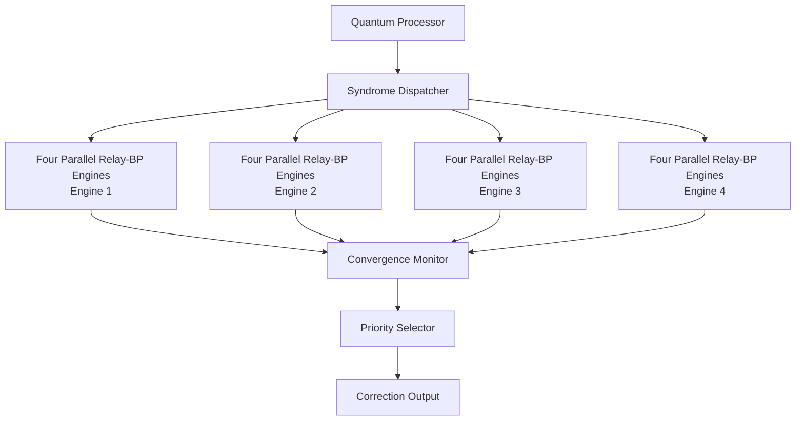

# Parallel Relay-BP FPGA System Block Diagram

This diagram shows the high-level dataflow for a Parallel Relay-BP FPGA decoder. The quantum processor produces syndrome information, the syndrome dispatcher broadcasts it to four Relay-BP engines, the convergence monitor checks the lane outputs, the priority selector chooses the best valid result, and the correction output is sent downstream for quantum error correction.