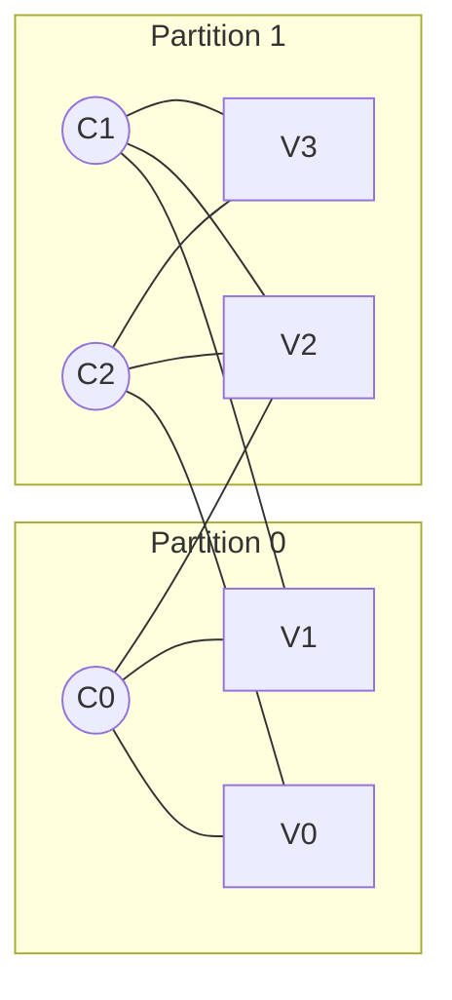
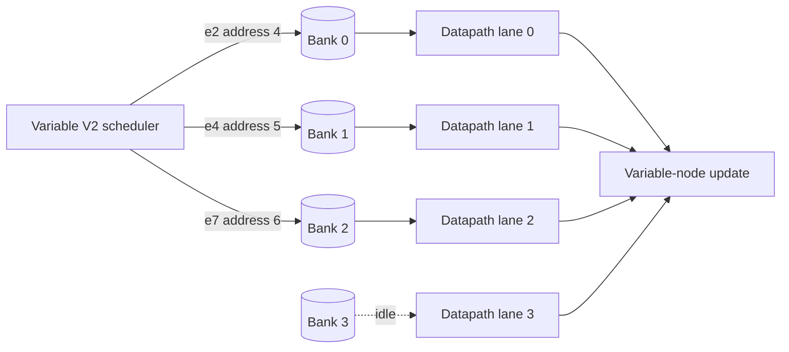
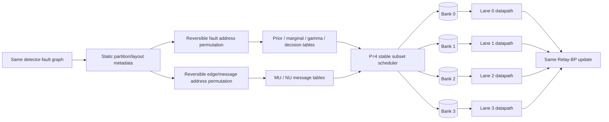

# Example: graph layout over the P=4 folded datapath

> Scope: professor-facing software-model illustration. This is not a new RTL
> architecture and does not change Relay-BP equations or graph connectivity.

## 1. Mathematical decoding graph

The small fixture is

```text
C0 -> V0, V1, V2
C1 -> V1, V2, V3
C2 -> V0, V2, V3
```

Its nine mathematical incidences are retained exactly:

```text
e0=C0--V0  e1=C0--V1  e2=C0--V2
e3=C1--V1  e4=C1--V2  e5=C1--V3
e6=C2--V0  e7=C2--V2  e8=C2--V3
```

Partitioning/layout changes only storage addresses. It never deletes, duplicates,
or redirects one of these incidences.

## 2. Conceptual graph partitions

One illustrative locality assignment is

```text
Partition 0: C0, V0, V1
Partition 1: C1, C2, V2, V3
```

Cross-partition incidences remain present. A partition ID is therefore layout
metadata, not permission to remove an edge.



## 3. Bank-aware address assignment

The implemented P=4 model selects a physical bank by

```text
bank = logical_address mod 4
```

A BA2-style layout first assigns a desired residue, then places an item only in
addresses `residue + 4*k`. For illustration:

| Mathematical item | New address | Bank |
|---|---:|---:|
| V0 | 0 | 0 |
| V1 | 1 | 1 |
| V2 | 2 | 2 |
| V3 | 3 | 3 |
| e2 | 4 | 0 |
| e4 | 5 | 1 |
| e7 | 6 | 2 |

The forward and inverse tables preserve mathematical identity:

```text
old ID -> new address -> old ID
```

## 4. From one access group to four datapath lanes

Suppose the variable update for `V2` needs messages on `e2`, `e4`, and `e7`.
With the illustrative bank-aware addresses above:

```text
request group: e2@4, e4@5, e7@6
banks:            0,    1,    2
```

All three requests can issue together:



This issued subset has three active lanes and requires no retry.

## 5. What a conflict looks like

If the same three messages instead had addresses `4`, `8`, and `6`, their banks
would be `0`, `0`, and `2`:

```text
original request: [e2@4, e4@8, e7@6]
first subset:     [e2@4,       e7@6]  -> banks 0 and 2
retry subset:            [e4@8]       -> bank 0
```

The stable scheduler lets the first pending lane for each bank win. The other
bank-0 request is retried. BA2 attempts to avoid assigning the same residue to
items that frequently occur in one request group.

## 6. Full dataflow context



The four lanes are folded arithmetic lanes processing one trajectory. They are
not four independent mathematical graph partitions and do not run different
Relay-BP equations. Partitioning and bank-aware ordering only try to present
more mutually compatible memory addresses to these lanes each issued cycle.

## 7. Interpretation of the current BA2 result

In the full Tier-2 software access model, BA2 makes every modeled variable-phase
MU and NU group conflict-free. Convergence improves, while relay initialization
regresses. The aggregate software-model result is higher lane utilization and
fewer retry subsets. This document illustrates the mechanism only; it is not an
FPGA speedup claim.
