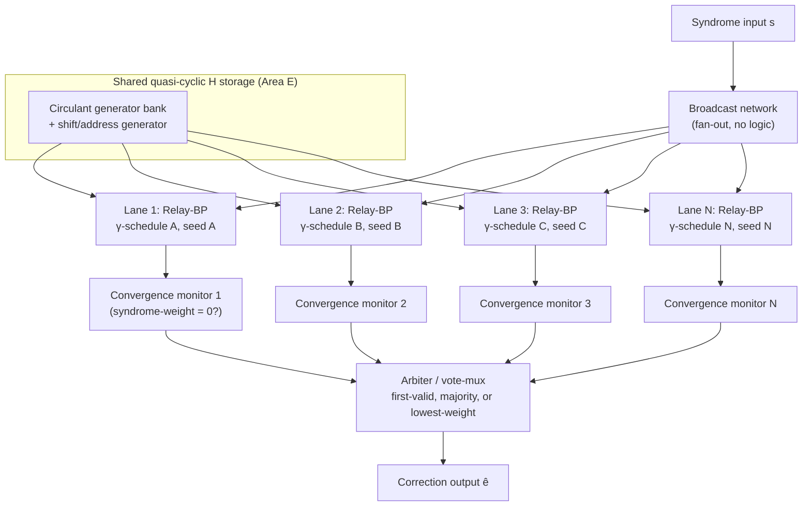
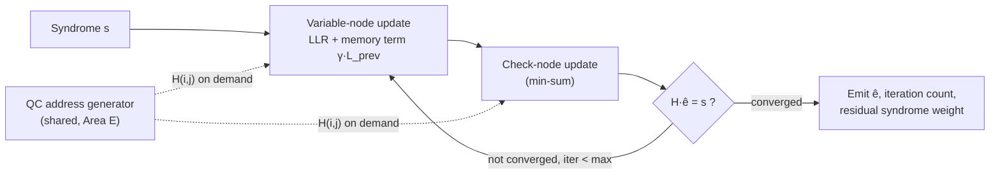
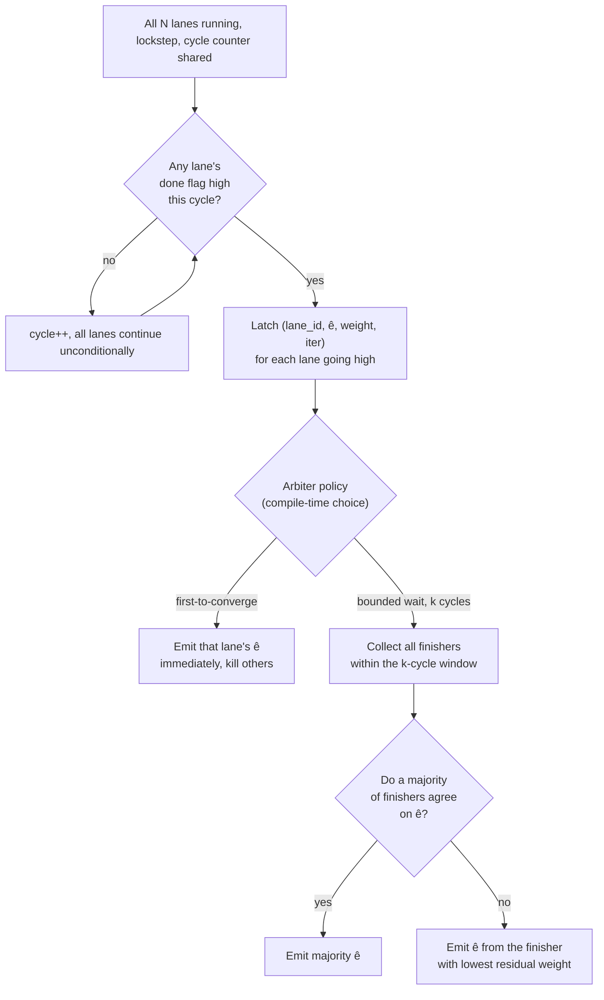
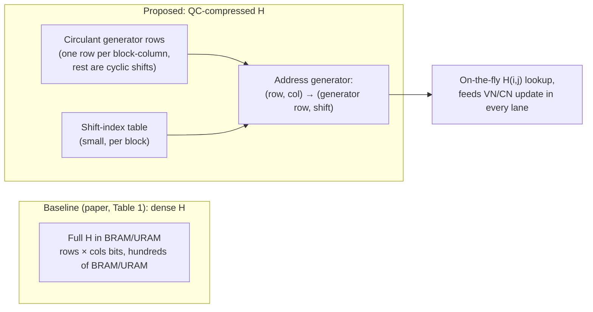
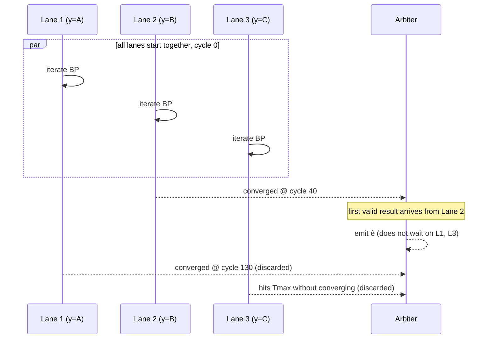

# Parallel-Lane Relay-BP Ensembling + Quasi-Cyclic Compressed H
### A combined proposal (Areas A + E)

**Thesis in one line:** free up BRAM/URAM by storing `H` in a quasi-cyclic
(circulant-block) form instead of dense, and reinvest that freed memory in
several Relay-BP lanes that run unconditionally, in lockstep, racing each
other to convergence — with only a final mux/vote deciding the winner.

This keeps everything inside the message-passing decoder class the paper
already shows wins, uses conditionals *only* at the very end (mux, not
skip-work), and directly answers the two "future directions" the paper
leaves open: FPGA-specific space/time optimization of BP scheduling, and
exploiting the repeated-submatrix structure noted in Sec. 5.7.

---

## 1. Top-level system block diagram

Key point: every lane is wired identically and runs every cycle — there is
no per-instance branching. The only conditional in the whole design is the
arbiter's final select, which is a combinational mux driven by "done" flags,
not a control-flow decision that skips work.

---

## 2. Single-lane pipeline (what's inside each Relay-BP lane)

The variable/check-node update loop is untouched Relay-BP — the only new
element per lane is a distinct `(γ-schedule, seed)` pair, and a shared
address generator replacing a dense per-lane memory copy.

---

## 3. Arbiter decision logic

`k` is a small fixed constant (e.g. 2–8 cycles) — bounded, so this is still
O(1) extra latency, not a re-introduction of the tail problem.

---

## 4. Quasi-cyclic compressed storage vs. dense (Area E)

Because the same generator bank is shared across *all* lanes (Section 1),
the freed BRAM/URAM is not just "saved" — it is the resource that literally
pays for lane N+1, N+2, … This is what turns A and E into one coherent
narrative rather than two separate tweaks.

---

## 5. Timing view: why this attacks the tail specifically

In the sequential/escalation picture, a single unlucky leg dominates
`T_max`. Here, `T_max` for the ensemble is (in the first-to-converge policy)
the **minimum** across lanes rather than a single draw — which is exactly
why tail latency (not mean latency) is expected to shrink, since it's the
tail draws that ensembling suppresses most.

---

## 6. What the accompanying simulation shows

`relay_ensemble_sim.py` is a proxy simulation (not RTL) that demonstrates
the two claims numerically on a synthetic quasi-cyclic parity-check matrix:

1. **Memory**: dense-bit-count vs. QC-generator-bit-count for the same `H`,
   to quantify the BRAM/URAM budget freed by Area E.
2. **Latency**: Monte Carlo comparison of a single Relay-BP-style lane vs.
   an N-lane ensemble (different γ-schedules/seeds per lane, first-to-converge
   policy), reporting mean *and* tail (95th/99th percentile) decode latency —
   since the tail is the quantity Area A is meant to shrink, not the mean.

This is a behavioral proxy for arguing the shape of the effect and sizing
the tradeoff (freed BRAM vs. added lanes vs. tail-latency reduction); it is
not a substitute for HLS/RTL implementation and post-synthesis timing, which
would be the natural next step after the professor buys the direction.
